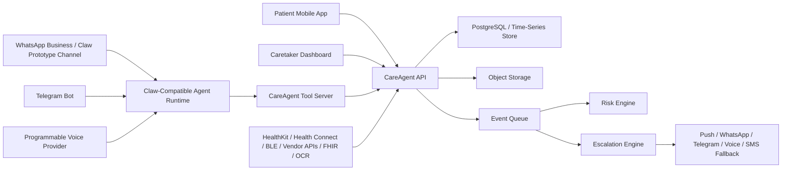
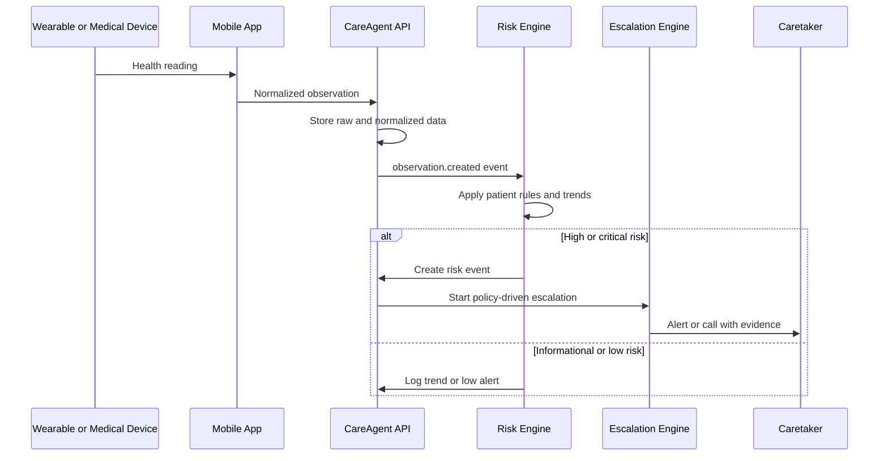
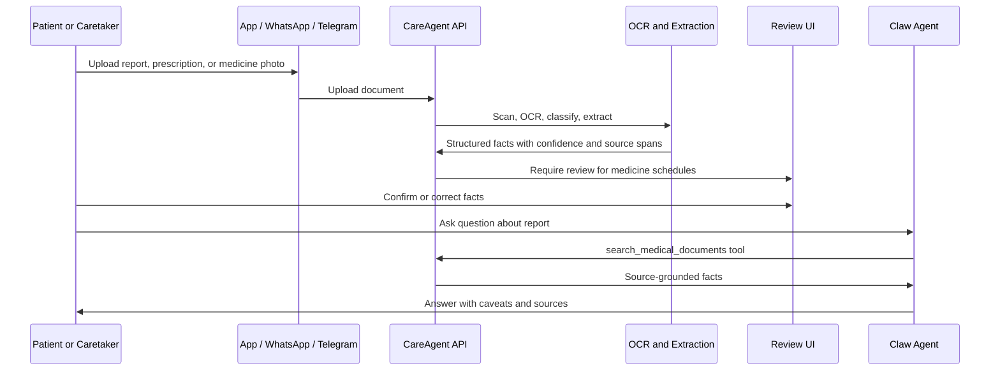
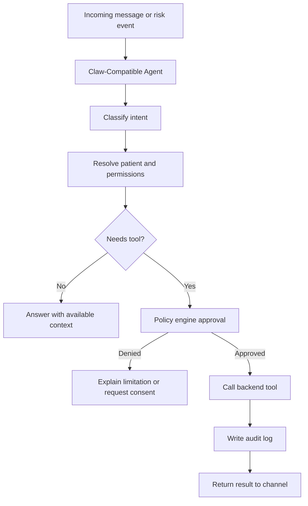
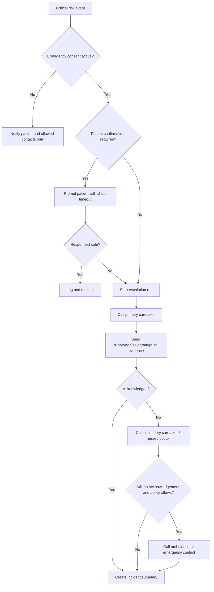
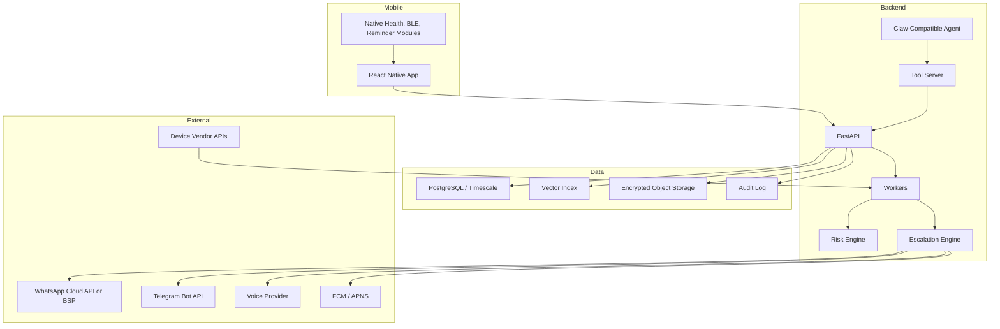

# Architecture Diagrams

## 1. System Context

```mermaid
flowchart LR
  Patient["Patient Mobile App"] --> API["CareAgent API"]
  Caretaker["Caretaker Dashboard"] --> API
  WhatsApp["WhatsApp Business / Claw Prototype Channel"] --> Agent["Claw-Compatible Agent Runtime"]
  Telegram["Telegram Bot"] --> Agent
  Voice["Programmable Voice Provider"] --> Agent
  Agent --> Tools["CareAgent Tool Server"]
  Tools --> API
  API --> DB["PostgreSQL / Time-Series Store"]
  API --> Obj["Object Storage"]
  API --> Queue["Event Queue"]
  Queue --> Risk["Risk Engine"]
  Queue --> Escalation["Escalation Engine"]
  Escalation --> Channels["Push / WhatsApp / Telegram / Voice / SMS Fallback"]
  Devices["HealthKit / Health Connect / BLE / Vendor APIs / FHIR / OCR"] --> API
```

## 2. Health Data Flow

```mermaid
sequenceDiagram
  participant Device as Wearable or Medical Device
  participant App as Mobile App
  participant API as CareAgent API
  participant Risk as Risk Engine
  participant Esc as Escalation Engine
  participant Care as Caretaker

  Device->>App: Health reading
  App->>API: Normalized observation
  API->>API: Store raw and normalized data
  API->>Risk: observation.created event
  Risk->>Risk: Apply patient rules and trends
  alt High or critical risk
    Risk->>API: Create risk event
    API->>Esc: Start policy-driven escalation
    Esc->>Care: Alert or call with evidence
  else Informational or low risk
    Risk->>API: Log trend or low alert
  end
```

## 3. Document Intelligence Flow

```mermaid
sequenceDiagram
  participant User as Patient or Caretaker
  participant Channel as App / WhatsApp / Telegram
  participant API as CareAgent API
  participant OCR as OCR and Extraction
  participant Review as Review UI
  participant Agent as Claw Agent

  User->>Channel: Upload report, prescription, or medicine photo
  Channel->>API: Upload document
  API->>OCR: Scan, OCR, classify, extract
  OCR->>API: Structured facts with confidence and source spans
  API->>Review: Require review for medicine schedules
  User->>Review: Confirm or correct facts
  User->>Agent: Ask question about report
  Agent->>API: search_medical_documents tool
  API->>Agent: Source-grounded facts
  Agent->>User: Answer with caveats and sources
```

## 4. Agent Action Flow

```mermaid
flowchart TD
  Msg["Incoming message or risk event"] --> Agent["Claw-Compatible Agent"]
  Agent --> Intent["Classify intent"]
  Intent --> Scope["Resolve patient and permissions"]
  Scope --> NeedTool{"Needs tool?"}
  NeedTool -->|No| Answer["Answer with available context"]
  NeedTool -->|Yes| Policy["Policy engine approval"]
  Policy -->|Denied| SafeReply["Explain limitation or request consent"]
  Policy -->|Approved| Tool["Call backend tool"]
  Tool --> Audit["Write audit log"]
  Audit --> Response["Return result to channel"]
```

## 5. Emergency Escalation Flow

```mermaid
flowchart TD
  Critical["Critical risk event"] --> Consent{"Emergency consent active?"}
  Consent -->|No| Notify["Notify patient and allowed contacts only"]
  Consent -->|Yes| Confirm{"Patient confirmation required?"}
  Confirm -->|Yes| Prompt["Prompt patient with short timeout"]
  Prompt --> Timeout{"Responded safe?"}
  Timeout -->|Yes| Log["Log and monitor"]
  Timeout -->|No| Start["Start escalation run"]
  Confirm -->|No| Start
  Start --> C1["Call primary caretaker"]
  C1 --> M1["Send WhatsApp/Telegram/push evidence"]
  M1 --> Ack{"Acknowledged?"}
  Ack -->|Yes| Summary["Create incident summary"]
  Ack -->|No| C2["Call secondary caretaker / nurse / doctor"]
  C2 --> Emergency{"Still no acknowledgement and policy allows?"}
  Emergency -->|Yes| Ambulance["Call ambulance or emergency contact"]
  Emergency -->|No| Summary
  Ambulance --> Summary
```

## 6. Deployment View

```mermaid
flowchart TB
  subgraph Mobile
    RN["React Native App"]
    Native["Native Health, BLE, Reminder Modules"]
  end

  subgraph Backend
    API["FastAPI"]
    Worker["Workers"]
    Agent["Claw-Compatible Agent"]
    ToolServer["Tool Server"]
    Risk["Risk Engine"]
    Esc["Escalation Engine"]
  end

  subgraph Data
    PG["PostgreSQL / Timescale"]
    Vector["Vector Index"]
    Storage["Encrypted Object Storage"]
    Audit["Audit Log"]
  end

  subgraph External
    WA["WhatsApp Cloud API or BSP"]
    TG["Telegram Bot API"]
    Voice["Voice Provider"]
    Push["FCM / APNS"]
    Vendors["Device Vendor APIs"]
  end

  RN --> API
  Native --> RN
  API --> PG
  API --> Storage
  API --> Audit
  API --> Worker
  Worker --> Risk
  Worker --> Esc
  Agent --> ToolServer
  ToolServer --> API
  API --> Vector
  Esc --> WA
  Esc --> TG
  Esc --> Voice
  Esc --> Push
  Vendors --> Worker
```
