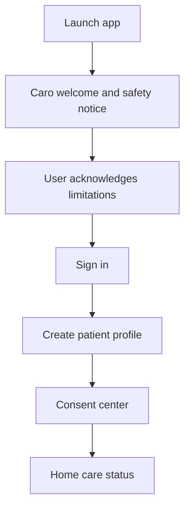
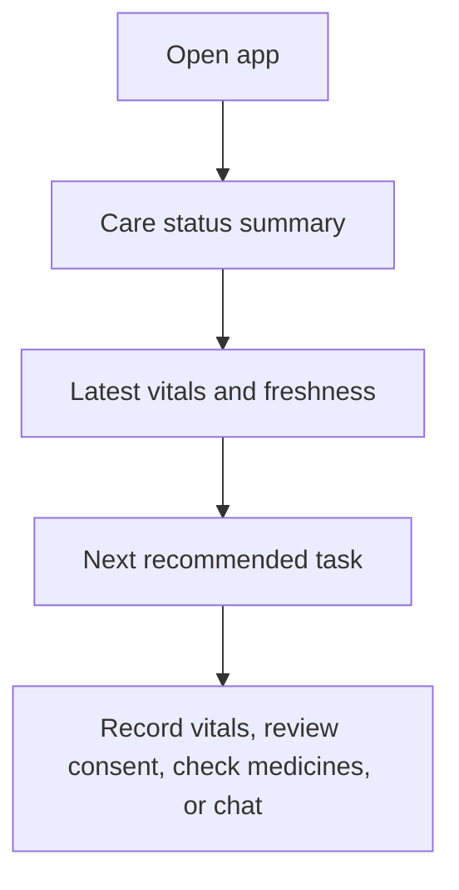
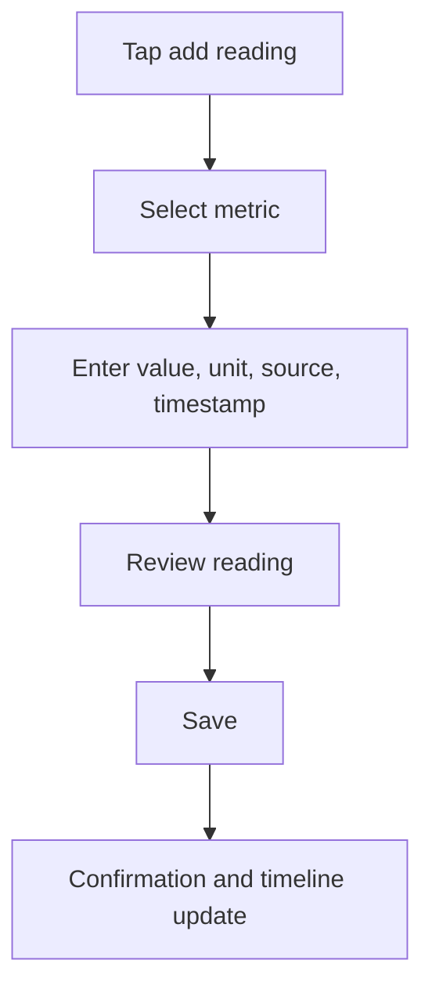
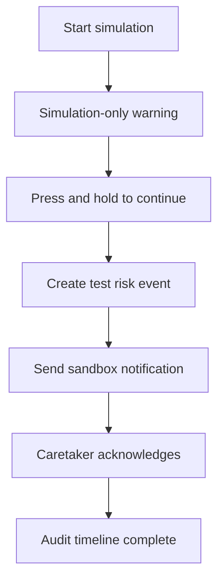
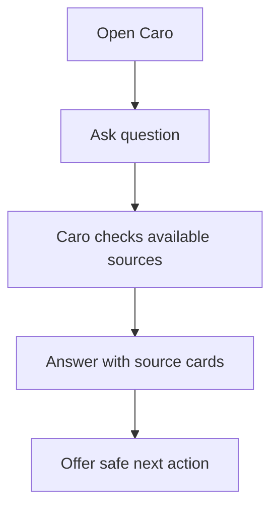

# CareAgent UI/UX Brand Identity and Caro Experience System

Prepared for: CareAgent  
Prepared by: Senior Product Experience and Brand Systems Audit  
Date: 12 May 2026  
Status: Foundational UI/UX direction for production frontend implementation  
Scope: Brand identity, visual system, typography, color, motion, Caro companion behavior, human interaction design, user flows, accessibility, and implementation acceptance criteria.

---

## 1. Executive Positioning

CareAgent should not look or feel like a generic medical dashboard. It should feel like a private care companion: calm enough for elderly users, precise enough for clinical-adjacent workflows, and warm enough for family caretakers who are often acting under stress.

The product identity must balance two truths:

1. CareAgent is emotionally supportive.
2. CareAgent is safety-critical and must never pretend to be a doctor, emergency service, or human caretaker.

Recommended brand experience: **Soft Clinical Companion**.

The interface should feel:

- Soft, but not childish.
- Human, but not informal.
- Reassuring, but not overconfident.
- Premium, but not decorative.
- iOS-inspired, but still Flutter-native and Android-ready.
- Friendly, but very serious during risk, consent, and emergency simulation flows.

## 2. Brand Thesis

### 2.1 Brand Promise

CareAgent helps patients and caretakers understand what is happening, what needs attention, and what safe next step is available.

### 2.2 Brand Personality

| Trait | Meaning in Product |
| --- | --- |
| Calm | The app reduces anxiety through clear hierarchy, stable layouts, and gentle language. |
| Watchful | The app keeps track of freshness, consent, alerts, and acknowledgements. |
| Respectful | Users stay in control of consent, contacts, documents, and emergency simulation. |
| Precise | Health data always shows source, time, unit, and confidence state. |
| Warm | Caro guides users with human-like care while avoiding exaggerated emotion. |
| Accountable | Important actions are confirmed, logged, and explainable. |

### 2.3 Differentiation Anchor

If the CareAgent logo were removed, users should still recognize the product through:

- A calm care-status home screen.
- A soft teal-and-warm-neutral color system.
- Caro, the restrained care companion.
- Source-backed health cards.
- Clear freshness, consent, and simulation labels.
- Gentle motion that communicates state without distracting from safety.

## 3. Brand System Name

Recommended internal design system name: **CareSignal**.

CareSignal is the UI language behind CareAgent. It is built around five visible product signals:

1. **Status**: Is the user safe, pending, stale, at risk, or in simulation?
2. **Source**: Where did this data come from?
3. **Freshness**: How recent and reliable is the data?
4. **Consent**: Is this action allowed?
5. **Next step**: What should the user do now?

Every major screen should answer these five questions quickly.

## 4. Core Experience Principles

### 4.1 Safety Before Delight

Delight is welcome only after safety is clear. During alerts, emergency simulation, consent revoke, failed delivery, or stale health data, the interface must become more direct and less expressive.

### 4.2 Guided, Not Dense

The frontend should avoid exposing a control panel to patients. Instead, it should guide the user through care tasks:

- Set up profile.
- Give consent.
- Add or connect vitals.
- Review status.
- Simulate escalation.
- Confirm caretaker acknowledgement.

### 4.3 Human, But Auditable

Caro can speak warmly, but every health-related statement must remain traceable, limited, and safe. The app should show source cards, timestamps, and confirmation steps for meaningful actions.

### 4.4 Soft iOS Quality

Softness should come from spacing, typography, tone, motion, and surface hierarchy. Avoid decorative gradients, floating blobs, or visual effects that make the healthcare experience feel unserious.

### 4.5 Designed for Stress

Users may be anxious, elderly, distracted, or caring for someone else. Primary actions must be large, obvious, and supported by plain language.

## 5. Visual Identity

### 5.1 Visual Direction

Name: **Soft Clinical Companion**

Description: A quiet healthcare interface with warm neutral backgrounds, teal identity color, soft but controlled surfaces, source-backed data cards, and a companion presence that appears at the right moments.

Avoid:

- Harsh hospital blue-only palettes.
- Playful cartoon healthcare.
- Decorative gradients as the primary brand device.
- Overly corporate SaaS dashboards.
- Dense admin tables on patient-facing screens.
- Placeholder or engineering vocabulary.

### 5.2 Logo and Brand Mark Direction

Recommended mark concept: a rounded care shield with a small pulse check line or subtle check detail.

The mark should communicate:

- Protection.
- Monitoring.
- Consent and safety.
- Calm care.

The mark should not communicate:

- Emergency service authority.
- Hospital certification.
- Doctor replacement.
- Cartoon entertainment.

### 5.3 Caro Visual Direction

Caro should be a companion mark, not a mascot costume.

Recommended shape language:

- Rounded shield or soft capsule face.
- Minimal facial expression.
- Small pulse-line detail.
- Calm eyes or simple attention state.
- No arms, props, lab coat, stethoscope, ambulance, or doctor costume.

Caro should feel like a trustworthy product companion, closer to a soft health assistant icon than a character from a children's app.

## 6. Color System

### 6.1 Color Strategy

CareAgent should use a clinical teal identity with warm neutral surfaces and carefully separated semantic colors. The palette must support light and dark modes from the start.

Do not make every surface teal. Teal should indicate identity and primary progression. Health state colors must be distinct and accessible.

### 6.2 Core Palette

| Token | Light | Dark | Usage |
| --- | --- | --- | --- |
| `brand.primary` | `#0B6E69` | `#5BC7BD` | Main brand, primary buttons, active navigation. |
| `brand.primarySoft` | `#DDF3EF` | `#173C38` | Soft brand backgrounds and selected states. |
| `brand.ink` | `#102421` | `#F2FBF8` | Primary text and high-emphasis content. |
| `surface.canvas` | `#F7FAF8` | `#0F1716` | App background. |
| `surface.base` | `#FFFFFF` | `#17211F` | Cards, sheets, main panels. |
| `surface.soft` | `#EEF7F4` | `#20302D` | Banners, assistant areas, low-risk notices. |
| `surface.raised` | `#FFFFFF` | `#1E2B28` | Floating sheets and modal surfaces. |
| `text.primary` | `#17201E` | `#F3FAF7` | Primary text. |
| `text.secondary` | `#5E6B67` | `#A8B8B3` | Secondary text. |
| `text.tertiary` | `#7B8984` | `#7F928C` | Metadata, timestamps, helper copy. |
| `border.subtle` | `#DDE8E4` | `#2D403B` | Dividers and card borders. |

### 6.3 Semantic Palette

| Token | Light | Dark | Usage |
| --- | --- | --- | --- |
| `status.normal` | `#2E7D62` | `#7AD6AF` | Normal status, successful saves. |
| `status.info` | `#2563A8` | `#87BFFF` | Guidance and neutral system information. |
| `status.caution` | `#B7791F` | `#F6C66E` | Stale data, missing setup, review needed. |
| `status.urgent` | `#B42318` | `#FF8A80` | Risk event, emergency simulation, failed safety action. |
| `status.simulation` | `#6D5BD0` | `#B8A9FF` | Test-mode emergency simulation. |
| `status.disabled` | `#98A6A1` | `#65736E` | Unavailable actions. |

### 6.4 Color Governance

Rules:

- Urgent red must never be used decoratively.
- Simulation purple must always be paired with clear "Simulation only" text.
- Caution amber must not look like normal status.
- Success green should confirm completed actions, not imply medical safety.
- Brand teal should not replace semantic status colors.

## 7. Typography System

### 7.1 Recommended Font Stack

| Role | Font | Rationale |
| --- | --- | --- |
| Display and section headings | Sora | Rounded, modern, distinctive, precise enough for healthcare. |
| Body and UI text | Nunito Sans | Warm, highly readable, softer than default system fonts. |
| Vitals, units, timestamps | IBM Plex Mono | Clear numeric rhythm for readings and audit-like metadata. |

Implementation note: bundle fonts locally for predictable mobile rendering. If font licensing or bundle size becomes a blocker, use platform fonts temporarily but keep the same typographic proportions.

### 7.2 Type Scale

| Token | Size | Line Height | Usage |
| --- | ---: | ---: | --- |
| `display.large` | 32 | 40 | First-run welcome and major status moments. |
| `display.medium` | 28 | 36 | Home status headline. |
| `title.large` | 24 | 32 | Screen titles. |
| `title.medium` | 20 | 28 | Section titles and task groups. |
| `title.small` | 17 | 24 | Card titles. |
| `body.large` | 16 | 24 | Primary readable text. |
| `body.medium` | 14 | 21 | Default UI body. |
| `body.small` | 13 | 18 | Helper copy and supporting labels. |
| `label.large` | 14 | 18 | Buttons and tabs. |
| `label.small` | 12 | 16 | Badges, metadata, freshness labels. |
| `metric.large` | 30 | 36 | Vitals value display. |
| `metric.small` | 16 | 22 | Units and compact readings. |

### 7.3 Typography Rules

- Body text must not drop below 14px in normal UI.
- Critical safety text must be at least 16px where possible.
- Vitals must use clear unit and source labels.
- Avoid long all-caps labels.
- Avoid negative letter spacing.
- Keep line length readable, especially in disclosures and consent text.

## 8. Layout and Surface System

### 8.1 Mobile Layout

Primary target: Android and iOS phone screens.

Rules:

- Primary navigation should be bottom-first for patient app areas.
- Use top bars for status and context, not heavy navigation.
- Keep critical actions reachable with one hand.
- Use vertical task rhythm instead of dense grids.
- Avoid navigation drawer as the primary patient experience.

### 8.2 Desktop/Web Layout

Desktop should not simply center a small mobile card in a large blank field.

Rules:

- Use a responsive two-column or centered content-plus-context composition.
- Keep patient-facing content readable at 390px, 768px, and 1440px.
- Use max widths intentionally: disclosures can cap text width, but the surrounding screen still needs designed context.
- Avoid large empty canvas unless it clearly supports focus.

### 8.3 Radius and Shape

| Element | Radius |
| --- | ---: |
| Repeated cards | 8 |
| Buttons | 12 |
| Input fields | 12 |
| Bottom sheets | 24 top corners |
| Badges and pills | 999 |
| Caro expression bubble | 20 |
| SOS action | circular or pill depending on flow |

Cards should stay disciplined. Softness should come from spacing, color, type, and motion rather than overly rounded card stacks.

### 8.4 Spacing

Base spacing unit: 4px.

| Token | Value | Usage |
| --- | ---: | --- |
| `space.1` | 4 | Tight icon/text pairing. |
| `space.2` | 8 | Compact internal spacing. |
| `space.3` | 12 | Form field spacing. |
| `space.4` | 16 | Standard screen padding. |
| `space.5` | 20 | Card inner padding. |
| `space.6` | 24 | Section separation. |
| `space.8` | 32 | Screen-level rhythm. |
| `space.10` | 40 | Major flow separation. |

## 9. Caro Companion System

### 9.1 Caro's Product Role

Caro is the CareAgent companion that helps users understand state, complete tasks, and feel supported.

Caro does:

- Welcome the user.
- Explain safety limitations.
- Guide onboarding.
- Explain why consent is needed.
- Help record vitals.
- Show when data is stale.
- Summarize safe next steps.
- Provide source-backed answers.
- Support emergency simulation without implying real dispatch.
- Help caretakers understand acknowledgements.

Caro does not:

- Diagnose.
- Prescribe.
- Claim certainty where data is incomplete.
- Pretend to be a doctor, nurse, family member, or emergency dispatcher.
- Use humor during alerts, consent, or emergency simulation.
- Randomly change risk explanations.
- Hide limitations.

### 9.2 Caro Personality

| Dimension | Direction |
| --- | --- |
| Voice | Calm, clear, respectful. |
| Confidence | Grounded, never exaggerated. |
| Emotion | Warm in normal flows, serious in risk flows. |
| Language | Plain, short, and actionable. |
| Boundaries | Explicit about limitations and consent. |

Example tone:

- Good: "I can help you record this reading. Please add the value, unit, and when it was taken."
- Good: "This is a simulation. No real emergency call will be placed."
- Bad: "Don't worry, everything is fine."
- Bad: "I diagnosed a problem."
- Bad: "Emergency help is on the way" unless a legally validated real dispatch integration exists.

### 9.3 Caro Visual States

| State | Visual Behavior | Emotional Meaning | Where Used |
| --- | --- | --- | --- |
| Neutral | Still, soft expression | Present and available | Home, app shell, chat entry. |
| Greeting | Gentle fade-in | Welcome and orientation | First launch, onboarding. |
| Listening | Subtle pulse or blink | Paying attention | Chat, symptom note, voice setup. |
| Confirming | Small check animation | Task completed | Vitals saved, consent updated. |
| Concerned | Still, focused expression | Needs review | Stale data, missing setup, failed delivery. |
| Simulation | Purple-accent state | Test mode only | Emergency simulation. |
| Unavailable | Muted state | Cannot complete action | Offline, backend unavailable, permission missing. |
| Handoff | Directional glance or small signal | Moving to caretaker/action timeline | Alert acknowledgement. |

### 9.4 Caro Placement Rules

Caro should appear:

- On first-run welcome.
- In empty states.
- In onboarding guidance.
- In chat and assistant surfaces.
- In non-critical confirmation moments.
- In simulation summary as a clear test-mode guide.

Caro should not dominate:

- SOS action confirmation.
- Consent legal text.
- Risk evidence cards.
- Error details.
- Medical document source review.

### 9.5 Caro Interaction Model

Caro should interact through:

1. **Visual state**: a calm companion mark that reflects the current app state.
2. **Short guidance**: one or two lines that explain the next step.
3. **Action cards**: buttons for safe next actions.
4. **Source cards**: when answering from records or vitals.
5. **Progress timeline**: when an escalation simulation or acknowledgement is happening.
6. **Voice/call script**: only in approved, disclosed calling-agent flows.

## 10. Human Interaction Design

### 10.1 Human-Like Elements to Add

| Element | Purpose | Safety Rule |
| --- | --- | --- |
| Warm greeting | Reduce cold onboarding feel | Must not overpromise monitoring. |
| Guided task list | Make setup easy | Must show incomplete safety steps. |
| Care status sentence | Explain state in plain language | Must include source/freshness when health-based. |
| Caro prompt | Help users continue | Must not replace consent or disclaimers. |
| Micro-confirmations | Show action success | Must not imply medical safety. |
| Gentle reminders | Support adherence | Must allow dismiss/snooze where appropriate. |
| Care timeline | Explain what happened | Must be audit-aligned. |
| Empty states | Prevent confusion | Must explain how to add data safely. |

### 10.2 Emotional State Framework

| User Moment | User Feeling | UI Response |
| --- | --- | --- |
| First launch | Uncertain | Warm welcome, safety statement, simple next action. |
| Profile incomplete | Mildly overwhelmed | Checklist with one recommended next step. |
| Consent requested | Protective | Explain purpose, data used, and revoke option. |
| Vitals entered | Seeking confidence | Show saved value, unit, source, timestamp. |
| Data stale | Possibly worried | Clear caution state and how to update. |
| Risk event | Stressed | Evidence-first layout, no decorative motion. |
| Simulation | Testing | Purple simulation labels, timeline, no real-call ambiguity. |
| Caretaker ack | Waiting | Delivery and acknowledgement progress. |
| Chat answer | Curious | Answer, source, confidence boundary, next action. |

### 10.3 Microcopy Rules

Use:

- "I can help you..."
- "This needs your review..."
- "Last updated..."
- "Simulation only..."
- "You can revoke this later..."
- "No real emergency call will be placed..."

Avoid:

- "You are safe."
- "I diagnosed..."
- "Emergency services are notified" unless true and validated.
- "Guaranteed."
- "Relax."
- "Placeholder."
- "Backend."
- "Pilot flow" in patient-facing screens.

## 11. Controlled Randomness and Personalization

### 11.1 Purpose

CareAgent should feel alive and personal, but never medically unpredictable.

### 11.2 Allowed Randomness

| Area | Example |
| --- | --- |
| Greeting | "Good morning. Let's check your care status." |
| Empty state support | "No readings yet. You can add one manually." |
| Low-risk encouragement | "Your profile setup is almost complete." |
| Loading copy | "Checking the latest records..." |
| Caro neutral expression | Minor static expression variation. |

### 11.3 Forbidden Randomness

Randomness must never affect:

- Medical advice.
- Risk category.
- Emergency instructions.
- Consent text.
- Legal disclaimers.
- Data source wording.
- Audit log content.
- Escalation status.

### 11.4 Phrase Catalog Governance

Every variable phrase should have:

- `phrase_id`
- `context`
- `risk_level`
- `allowed_user_role`
- `locale`
- `approved_by`
- `last_reviewed_at`

Critical and legal flows should default to fixed copy.

## 12. Motion and Animation System

### 12.1 Motion Personality

Motion should feel like breathing, not bouncing.

Motion goals:

- Explain state change.
- Reduce waiting anxiety.
- Confirm completed actions.
- Clarify simulation progression.
- Support Caro's presence without creating distraction.

### 12.2 Motion Tokens

| Token | Duration | Curve | Usage |
| --- | ---: | --- | --- |
| `motion.instant` | 80ms | easeOut | Press response, icon color change. |
| `motion.quick` | 160ms | easeOut | Button state, chip selection. |
| `motion.standard` | 240ms | easeInOut | Cards, section reveals, banners. |
| `motion.guided` | 320ms | easeInOutCubic | Onboarding transitions, sheet entry. |
| `motion.slow` | 480ms | easeOutCubic | First-run reveal, Caro greeting. |

### 12.3 Motion Rules

- Use opacity and transform-based animation.
- Avoid layout-shifting animation for critical content.
- Respect reduced motion.
- Do not loop urgent animations indefinitely.
- Do not use playful bounce in medical or emergency contexts.
- Limit screen entrance staggers to 80ms between items.

### 12.4 Required Animations

| Flow | Animation |
| --- | --- |
| First-run safety | Calm content reveal and Caro entrance. |
| Onboarding progress | Step transition and progress indicator update. |
| Consent update | Confirming state with clear saved/revoked result. |
| Vitals saved | Value card settles into timeline. |
| Stale data | Caution badge fades in with timestamp. |
| Emergency simulation | Press-and-hold progress and timeline advance. |
| Caretaker acknowledgement | Timeline node changes from sent to acknowledged. |
| Chat | Caro listening state and answer reveal. |

## 13. Core User Flows

### 13.1 First-Run Flow



Experience requirements:

- First screen must be full-screen and intentionally designed.
- Safety copy must be clear and readable.
- Caro may welcome, but must not reduce the seriousness of the limitation.
- User must understand the app does not replace emergency services.

### 13.2 Daily Home Flow



Experience requirements:

- Home must prioritize status, freshness, and next action.
- Avoid showing every feature at once.
- Caro should explain the next safest step.

### 13.3 Manual Vitals Flow



Experience requirements:

- Unit and source are mandatory.
- Timestamp must be visible.
- The app should warn if the value is old or incomplete.
- Confirmation should not imply clinical interpretation unless risk logic runs.

### 13.4 Emergency Simulation Flow



Experience requirements:

- Every screen must say simulation only.
- Use purple simulation state, not urgent red alone.
- No real call or dispatch language unless the integration is actually live and approved.
- Timeline must show each step and result.

### 13.5 Chat With Caro Flow



Experience requirements:

- Caro must show when an answer is based on records, vitals, or general app guidance.
- Medical limits must appear naturally, not as hidden fine print.
- Risky actions require confirmation cards.

## 14. Component System

### 14.1 Foundation Components

| Component | Purpose |
| --- | --- |
| `CareScaffold` | App shell with responsive layout and theme handling. |
| `CareTopBar` | Screen context, status, and profile access. |
| `CareBottomNav` | Patient-first navigation. |
| `CareStatusHeader` | Main home status summary. |
| `CareTaskCard` | Next recommended action. |
| `CareMetricCard` | Vitals with value, unit, source, freshness. |
| `CareTimeline` | Events, simulations, acknowledgements. |
| `CareConsentCard` | Purpose, scope, granted/revoked state. |
| `CareRiskBadge` | Normal, caution, urgent, simulation states. |
| `CaroCompanion` | Visual state and short guidance. |
| `CareEmptyState` | Friendly guidance when no data exists. |
| `CareActionSheet` | Focused task completion. |

### 14.2 Screen Templates

| Template | Screens |
| --- | --- |
| Guided setup | Welcome, profile, consent, contacts. |
| Status dashboard | Home, caretaker patient overview. |
| Timeline review | Alerts, escalation, acknowledgements. |
| Evidence review | Documents, extracted facts, source cards. |
| Conversation | Caro chat, WhatsApp/Telegram handoff. |
| Simulation | Emergency rehearsal and sandbox acknowledgement. |

## 15. Accessibility and Inclusion

CareAgent's primary users may include elderly people, people with chronic conditions, and caretakers under stress. Accessibility is not optional.

Requirements:

- Minimum 44x44px touch targets.
- Body text at least 16px for critical instructions.
- High contrast for all status labels.
- Visible focus states for web and keyboard users.
- Text scaling support.
- Reduced motion support.
- Clear labels for icon-only actions.
- Voice-friendly medicine and reminder flows.
- Minimal typing for elderly users.
- Plain language and local-language readiness.

## 16. Implementation Guidance for Flutter

### 16.1 Recommended Structure

```text
lib/
  design_system/
    care_theme.dart
    care_colors.dart
    care_typography.dart
    care_motion.dart
    components/
  features/
    auth/
    onboarding/
    consent/
    home/
    vitals/
    documents/
    chat/
    simulation/
  mascot/
    caro_companion.dart
    caro_state.dart
```

### 16.2 Theme Requirements

Flutter implementation must include:

- `theme`
- `darkTheme`
- `themeMode: ThemeMode.system`
- centralized semantic colors
- typography definitions
- motion tokens
- component-level states

### 16.3 Asset Requirements

Add asset folders:

```text
assets/
  caro/
  icons/
  illustrations/
  fonts/
```

Initial Caro should ship as static vector states before animated files are added.

## 17. Production Acceptance Criteria

The UI/UX foundation is accepted when:

1. CareAgent has a documented visual identity and token system.
2. Light and dark themes are defined and implemented.
3. Caro has documented roles, boundaries, visual states, and interaction rules.
4. First-run, home, vitals, consent, simulation, and chat flows are mapped.
5. User-facing copy avoids engineering terms and placeholder language.
6. Emergency simulation is visually and verbally unmistakable.
7. Motion tokens exist and respect reduced motion.
8. Core screens pass screenshot review at 390px, 768px, and 1440px.
9. Critical actions show source, consent, timestamp, and audit-friendly state.
10. The frontend feels calm, friendly, and human without becoming casual about safety.

## 18. Final Firm Recommendation

CareAgent should treat this document as the product's frontend design constitution. Before implementing more screens, the team should implement the CareSignal foundation: theme, typography, motion, Caro, empty states, and guided flows.

The product's competitive edge will not come from looking like another health dashboard. It will come from making safety-critical care coordination feel understandable, emotionally steady, and humanly guided.
