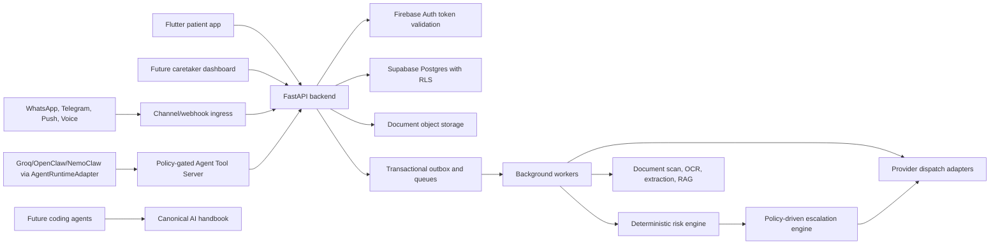

# CareAgent System Architecture And AI Project Handbook

Last reviewed: 2026-06-06

This is the canonical restart document for CareAgent. Read it first when a human, coding agent, or AI assistant opens a new context window. It summarizes the product intent, current repositories, verified implementation state, target architecture, safety boundaries, and next build order.

## 1. Project Overview

CareAgent is an agentic health coordination product for patients, elderly users, chronic-care users, and authorized caretakers. It monitors health signals, helps manage medicines and documents, answers record-grounded questions, and escalates risk through app alerts, channel messages, and voice calls where consent and policy allow it.

CareAgent must feel helpful, but it must be governed like safety-critical health software:

- It can assist, summarize, remind, alert, and coordinate.
- It must not diagnose, prescribe, change medication, or replace clinical judgment.
- It must not silently enable health data, contacts, SMS, calls, location, microphone, WhatsApp, Telegram, or emergency automation.
- It must audit PHI access, consent changes, agent tool calls, messages, calls, webhooks, risk events, and escalation actions.
- It must keep deterministic backend policy in control of high-risk actions.

Locked MVP architecture decisions:

- Identity: Firebase Auth for MVP user identity and app login.
- Data platform: Supabase hosted Postgres for durable PHI data, RLS, migrations, and future storage/vector services.
- MVP priority: harden one end-to-end pilot slice before building full feature breadth.
- Documentation format: one canonical Markdown handbook plus subsystem docs.
- Active frontend repo: `C:\Users\ASUS\Desktop\careagent`.
- Active backend repo: `C:\Users\ASUS\Desktop\careagent-backend`.

Deployment targets:

- Patient app: Android-first Flutter app, with Flutter web preview support.
- Backend API: FastAPI deployed to Render or equivalent Python host.
- Database: Supabase project `careagent-backend`, ref `kgkfrrffrjfltswwcsmw`, region `ap-south-1`, Postgres 17.
- Future caretaker dashboard: web app, likely separate frontend surface.
- Future channels: official WhatsApp Business Cloud API or approved BSP, Telegram Bot API, FCM/APNs, SMS fallback, programmable voice provider.

Stale-doc warning:

- Some older reports were accurate when written but are now historical. For example, older docs say the Flutter scaffold, CI, production settings, and migration discovery were missing. Current code has a Flutter shell, CI workflows, production settings validation, middleware guards, and a migration script that discovers all SQL migrations.
- Treat this handbook and current source code as the primary truth. Use older docs for rationale and backlog context, not as unquestioned current-state evidence.

## 2. Repository Map

### Frontend And Planning Repo

Path: `C:\Users\ASUS\Desktop\careagent`

Purpose:

- Flutter patient app shell.
- Product, design, architecture, mobile, agent, device, channel, safety, and backlog docs.
- Project-work execution packs for active implementation/deployment lanes.
- Design prototypes and screenshots.
- Prompts for parallel AI/coding-agent workstreams.

Important files:

- `README.md`: entry point for frontend/planning repo.
- `docs/24-ai-system-architecture-and-project-handbook.md`: this canonical handbook.
- `project-work/README.md`: implementation-oriented work packs.
- `project-work/openclaw-agent/README.md`: OpenClaw prototype gateway and runtime deployment pack.
- `project-work/remaining-work/README.md`: current execution queue derived from the newest gap reports.
- `lib/main.dart`: current Flutter shell, auth controller, safety gate, navigation, pilot workspace, placeholder sections.
- `lib/core/careagent_api.dart`: current pilot API client using Firebase ID tokens.
- `lib/config/app_config.dart`: reads `CAREAGENT_API_BASE_URL`.
- `lib/config/firebase_options.dart`: web Firebase options from dart defines, currently defaults to Studyspace project values.
- `android/app/build.gradle.kts`: Android package configuration.
- `.github/workflows/frontend-ci.yml`: Flutter analyze/test/web/APK build workflow.

### Backend Repo

Path: `C:\Users\ASUS\Desktop\careagent-backend`

Purpose:

- FastAPI backend.
- Pydantic API schemas.
- Supabase/Postgres migrations.
- OpenAPI contracts.
- Risk, policy, channel, escalation, agent-runtime, Make MCP voice adapter, and repository code.
- Backend docs, templates, scripts, and tests.

Important files:

- `README.md`: backend contract and runtime notes.
- `app/main.py`: FastAPI app, CORS, trusted hosts, request IDs, rate/body limits, audit flush.
- `app/api/routes.py`: route layer for auth, patients, consent, devices, observations, documents, medicines, risk, escalation, agent, audit.
- `app/core/config.py`: environment settings and production validation.
- `app/core/security.py`: Firebase/test actor resolution, permissions, patient scope.
- `app/core/request_context.py`: request-scoped DB actor context for RLS variables.
- `app/services/care_data.py`: `CareRepository` protocol, in-memory repository, Postgres repository selection via `DATABASE_URL`.
- `app/agent/runtime.py`: `AgentRuntimeAdapter` protocol, mock adapter, Groq chat-completions adapter, and secret redaction.
- `app/services/policy.py`: deterministic tool/action policy.
- `app/services/risk_engine.py`: deterministic risk rules and idempotency helpers.
- `app/services/channels.py`: provider abstraction, mock adapters, template rendering.
- `app/services/escalation.py`: in-memory escalation state machine and simulation runner.
- `app/services/make_mcp.py`: Make MCP voice adapter.
- `migrations/*.sql`: Supabase/Postgres schema source of truth.
- `.github/workflows/backend-ci.yml`: backend compile/test/migration validation workflow.

Do not deploy older split backend folders if they exist elsewhere on the machine. The consolidated backend repo is the active backend source.

## 3. Current Verified Implementation State

Verified on 2026-06-06:

- Frontend command: `flutter test --no-pub`
- Frontend result: 5 tests passed.
- Backend command: `python -m compileall app; python -m pytest`
- Backend result: 59 tests passed.

### Frontend Built

- Flutter project scaffold with Android and web support.
- CareAgent safety notice gate.
- Firebase Auth controller for Google sign-in, email/password sign-in, account creation, password reset, email verification, and sign-out.
- Versioned safety notice acknowledgement persisted locally through platform preferences.
- Basic app shell and navigation.
- Pilot workspace that can call selected backend APIs when `CAREAGENT_API_BASE_URL` is configured and a Firebase ID token exists.
- Pilot workspace can list, grant, show, and revoke backend-backed MVP consent after loading a patient profile.
- Pilot workspace can submit a manual vital, refresh latest vitals, and surface backend-generated risk/alert state for abnormal readings.
- Placeholder product sections for onboarding, consent, vitals, medicines, documents, chat, SOS/emergency readiness, caretaker, channels, and alerts.
- Caro companion visual component.
- Basic widget tests.
- Frontend CI workflow for analyze, test, web build, and Android release APK build with `GOOGLE_SERVICES_JSON_BASE64`.

### Frontend Mocked Or Placeholder

- Most product surfaces are not real workflows yet.
- Feature state is mostly in `lib/main.dart`; modular feature folders are not yet implemented.
- API client uses raw `Map<String, dynamic>` instead of typed DTOs.
- No Health Connect, HealthKit, BLE, local reminders, offline queue, document upload UI, document extraction review UI, real chat, channel linking, caretaker dashboard, or emergency provider flow.
- The Android/Firebase production credential path must use CareAgent-owned credentials, not Studyspace credentials.

### Backend Built

- FastAPI app with route coverage for health, auth/session, `me`, patients, care team, consents, device catalog, devices, observations, latest vitals, documents, medicines, dose events, risk events, alerts, escalation policies, escalation runs, agent messages/tools, and audit logs.
- Production settings validation rejects missing `DATABASE_URL`, admin DB users, invalid production CORS, wildcard trusted hosts, public docs in production, and real Make calls in production.
- Firebase token verifier exists for production auth mode.
- Test/header actor mode exists for local tests.
- `CareRepository` protocol with both in-memory and Postgres-backed implementations.
- Postgres repository path selected when `DATABASE_URL` is set.
- Request-scoped actor context is applied to Postgres connections with `app.user_id` and `app.role`.
- First-patient bootstrap contract prevents duplicate patient profiles, exposes the owned patient scope through `/me`, and lets the same actor reload the profile without sending a patient header in test mode. Real Firebase production mode still needs pilot verification with CareAgent-owned credentials.
- Supabase/Postgres migrations `001` through `008`.
- RLS-enabled public schema with patient-scope helper functions and security/performance hardening migrations.
- Deterministic risk engine for SpO2, glucose, heart rate, blood pressure, temperature, fall detection, stale data, quality scoring, and idempotency keys.
- Observation ingestion runs deterministic risk evaluation and creates risk events/alerts for abnormal readings in the repository path.
- Deterministic policy gates for agent tools, voice calls, emergency escalation, channel messages, and location sharing.
- Mock channel provider adapters for push, WhatsApp, Telegram, SMS, email, and voice.
- JSON-backed message templates and call scripts.
- In-memory escalation state machine and emergency simulation runner.
- Make MCP voice adapter for simulation calls, with real calls blocked unless explicitly enabled outside production.
- Audit event model and denied-request audit capture.
- Backend CI workflow for compile, tests, and migration validation dry run.

### Backend Mocked, Stubbed, Or Incomplete

- Groq chat-completions adapter is implemented for in-app AI replies when the backend has `AGENT_RUNTIME_ADAPTER=groq`, `AGENT_RUNTIME_PROVIDER=groq`, and `GROQ_API_KEY`.
- `/agent/messages` now routes through the configured runtime adapter, but it is not yet full source-grounded agent execution.
- `/agent/tools/{tool_name}` is still a contract/scaffold route.
- OpenClaw/NemoClaw runtime adapters are not implemented yet.
- Real WhatsApp, Telegram, FCM/APNs, SMS, email, and voice provider adapters are not implemented.
- Provider webhooks are not implemented.
- Channel linking and verification endpoints are in contracts/workstream docs, not fully implemented in FastAPI routes.
- Document upload returns a placeholder `s3://` style target through the repository path; signed object-storage upload is not production-ready.
- Malware scanning, OCR, extraction, fact review pipeline, vector indexing, and source-cited RAG are not implemented end to end.
- Durable background workers, Redis/SQS/PubSub queues, outbox publisher, retry processors, dead-letter handling, and observability are not implemented.
- Patient-specific risk threshold management and clinician review workflows are not implemented.
- Caretaker dashboard is not implemented.
- First-patient bootstrap and owner scope behavior must still be verified under real Firebase production mode before pilot use.

### Supabase MCP State

- Supabase MCP endpoint check returned `401` without a token, which means the endpoint is reachable.
- No `.mcp.json` exists in `careagent` or `careagent-backend` at the time this handbook was created.
- Supabase MCP database tools were not exposed in the thread that created this handbook.
- Future work should add project MCP configuration and complete OAuth in the agent host before relying on MCP tools.
- Do not commit Supabase access tokens, Postgres passwords, service role keys, Google OAuth secrets, or provider secrets.

## 4. Target System Architecture



### Component Responsibilities

Flutter patient app:

- Owns patient-facing UI, onboarding, consent UX, OS permissions, local reminders, manual entry, health-source setup, BLE pairing UI, document capture, chat UI, SOS UI, and offline sync queue.
- Must show source, timestamp, freshness, and confidence for health data.
- Must never make autonomous medical risk or escalation decisions locally.

Future caretaker dashboard:

- Owns multi-patient roster, alert inbox, timeline, device freshness, medicine adherence, document review, escalation acknowledgement, and care-team workflows.
- Must enforce patient-scoped authorization and audit every PHI view.

FastAPI backend:

- Owns API contracts, patient scope, RBAC, consent enforcement, audit, idempotency, risk creation, escalation authorization, repository access, provider orchestration, and agent tool policy.
- Must be the only authority for calls, messages, location sharing, emergency escalation, and patient data access.

Supabase/Postgres:

- Durable system of record for accounts, identities, patients, access grants, consent, contacts, devices, observations, medicines, documents, risk, escalation, conversations, tool calls, idempotency, outbox, and audit.
- RLS is defense in depth. The backend must use a restricted runtime DB role and set transaction-scoped actor context before PHI queries.

Workers and queues:

- Move long-running and retryable work out of request handlers.
- Process observation normalization, risk evaluation, document scan/OCR/extraction/indexing, medicine reminder planning, channel dispatch, voice dispatch, escalation execution, and audit export.

Agent runtime:

- Groq is the selected direct model provider for current in-app AI replies. `GROQ_API_KEY` must live only in the backend deployment environment.
- OpenClaw is the prototype channel/runtime gateway.
- NemoClaw is a production-hardening candidate around OpenClaw.
- Other runtimes can be evaluated behind `AgentRuntimeAdapter`.
- Runtime may orchestrate conversation and request tools, but it must not own safety policy, consent, emergency decisions, or PHI storage.

Provider adapters:

- Production providers must be official or approved: WhatsApp Business Cloud API/BSP, Telegram Bot API, FCM/APNs, SMS gateway where lawful, and programmable voice provider.
- Prototype WhatsApp Web style automation is not a production healthcare path unless compliance explicitly approves it.

Observability:

- Target state includes structured logs, request IDs, metrics, traces, uptime checks, queue lag, provider failure dashboards, call failure alerts, and incident runbooks.

## 5. Data And API Map

### Core Domains

| Domain | Main entities | Current route coverage | Important gaps |
| --- | --- | --- | --- |
| Auth/account | `user_accounts`, `auth_identities` | `/auth/session`, `/me` | Final production bootstrap, revoked/inactive session policy |
| Patient profile | `patient_profiles` | `/patients`, `/patients/{id}` | Full onboarding fields and owner-grant verification |
| Care team | `care_team_members`, `patient_access_grants`, `contact_endpoints` | `/patients/{id}/care-team` | Invite, contact verification, dashboard role workflows |
| Consent | `consent_grants`, `consent_ledger` | `/patients/{id}/consents`, revoke | Full consent center UI, revocation side effects, policy cache invalidation |
| Devices | `device_catalog`, `devices`, `device_connections` | `/device-catalog`, `/patients/{id}/devices` | Catalog detail, compatibility check, Health Connect, HealthKit, BLE |
| Observations | `observation_raw_payloads`, `observations`, quality tables | `/patients/{id}/observations`, `/vitals/latest` | Normalizer workers, partitions/rollups, source dedupe, simulator routes |
| Medicines | `medicines`, `medicine_schedules`, `medicine_dose_events` | CRUD/schedule/dose routes | Local reminders, missed-dose worker, extracted schedule proposal |
| Documents | `medical_documents`, `document_processing_runs`, `extracted_medical_facts` | upload init/list/detail/status/review/questions | Signed upload, malware scan, OCR, extraction, RAG, citations |
| Risk | `risk_rules`, `risk_events`, `alerts` | risk create, alerts, acknowledge | Patient thresholds, worker integration, false-positive feedback |
| Escalation | `escalation_policies`, `escalation_runs`, `escalation_actions` | policy, start, get, acknowledge | Durable runner, retries, real providers, incident summaries |
| Channels | provider configs, links, dispatch attempts, receipts, call events | service-layer mocks and contracts | Webhook routes, linking APIs, real adapters |
| Agent | `conversations`, `messages`, `agent_tool_calls` | `/agent/messages`, `/agent/tools/{tool_name}` | Runtime adapter, tool server, conversation persistence, citations |
| Audit | `audit_logs` | `/patients/{id}/audit-logs` | Full negative-path/background/provider audit coverage |

### Mobile API Header Rules

All authenticated mobile calls should use:

- `Authorization: Bearer <Firebase ID token>`
- `Content-Type: application/json`
- `X-Request-Id`: generated per API attempt for traceability.
- `Idempotency-Key`: required for document upload sessions, risk/SOS creation, escalation starts, provider actions, and any retryable write where duplicates are harmful.
- `X-Device-Install-Id`: future stable app-install identifier, rotated on logout/delete.
- `X-CareAgent-Test-Mode: true`: required for simulation-only emergency/provider flows.

The current `CareAgentApiClient` sends Firebase bearer tokens and selected idempotency headers, but it should be upgraded to typed DTOs, timeouts, consistent request IDs, retry/backoff where safe, and normalized errors.

### Backend Interface Boundaries

`CareRepository`:

- Stable repository protocol used by route handlers.
- Must support both local/in-memory tests and Postgres-backed deployment.
- Future work should keep route handlers thin and move multi-step workflow logic into services/workers.

`AgentRuntimeAdapter`:

- Stable agent runtime boundary.
- Current implementation: `MockAgentRuntimeAdapter` and `GroqAgentRuntimeAdapter`.
- Current Groq route use: in-app assistant text replies only; tool calling is disabled until policy-mediated tool execution is complete.
- Future implementations: OpenClaw, NemoClaw, OpenAI Agents SDK, LangGraph, or custom provider.

`ProviderAdapter`:

- Stable outbound channel/voice boundary.
- Current implementation: mock adapters plus Make MCP voice adapter.
- Future implementations: WhatsApp, Telegram, Push, SMS, email, voice.

`PolicyDecision`:

- Deterministic backend policy result for tools and critical actions.
- Agent outputs are never policy decisions.

Outbox event envelope:

```json
{
  "event_id": "uuid",
  "topic": "observation.created",
  "schema_version": 1,
  "occurred_at": "2026-06-06T00:00:00Z",
  "patient_id": "uuid",
  "actor": {
    "type": "system",
    "id": "observation-worker"
  },
  "idempotency_key": "stable-domain-key",
  "payload": {}
}
```

Workers must be idempotent. Replaying the same event key must not duplicate calls, messages, risk events, dose events, document facts, or escalation actions.

## 6. Supabase Architecture

### Project

- Project name: `careagent-backend`
- Project ref: `kgkfrrffrjfltswwcsmw`
- Region: `ap-south-1`
- Postgres major version: 17
- Local config: `C:\Users\ASUS\Desktop\careagent-backend\supabase\config.toml`

### Migration Order

Apply in filename order:

1. `001_initial_backend_platform.sql`
2. `002_health_device_integrations.sql`
3. `003_channels_calls_escalation.sql`
4. `004_security_lint_fixes.sql`
5. `005_performance_lint_fixes.sql`
6. `006_drop_generated_duplicate_indexes.sql`
7. `007_add_supabase_auth_provider.sql`
8. `008_add_supabase_auth_bridge.sql`

Use:

```powershell
$env:SUPABASE_DB_URL = "postgresql://postgres:<password>@db.kgkfrrffrjfltswwcsmw.supabase.co:5432/postgres"
.\scripts\apply_migrations.ps1
.\scripts\validate_migrations.ps1
```

Rules:

- Migration scripts use a Postgres connection URL, not a Supabase `service_role` JWT.
- Runtime `DATABASE_URL` must use a restricted app DB user, not `postgres` or `supabase_admin`.
- Do not expose `service_role`, secret keys, or Postgres passwords to Flutter or Vercel public variables.
- Every table in exposed `public` schema should have RLS enabled.
- Security definer functions should live in private/unexposed schemas where possible.
- RLS policies must match actual patient access rules, not blanket `auth.uid()` assumptions.

### Firebase Identity To Supabase Data

Active MVP path:

1. Flutter signs the user in with Firebase Auth.
2. Flutter sends Firebase ID token to FastAPI.
3. Backend verifies token through Firebase Admin.
4. Backend maps Firebase subject to `user_accounts` and `auth_identities`.
5. Backend resolves role, owned patient, and grants.
6. Backend sets DB actor context (`app.user_id`, `app.role`) before Postgres repository queries.
7. Supabase/Postgres RLS enforces defense-in-depth.

Supabase Auth bridge:

- Migrations `007` and `008` add Supabase as an allowed auth provider and synchronize `auth.users` into CareAgent account/identity tables.
- This exists as migration work and optional future direction, but it is not the active MVP login path.
- If the project later moves to Supabase Auth, update Flutter auth, backend JWT verification, RLS assumptions, and tests as one deliberate architecture change.

### Supabase MCP Setup Notes

Current state:

- MCP endpoint reachable without token returns `401`, which is expected.
- No project `.mcp.json` exists in either active repo.
- Supabase MCP tools were not exposed in the thread that produced this handbook.

Setup for future agents:

1. Confirm endpoint:

```powershell
curl.exe -so NUL -w "%{http_code}" https://mcp.supabase.com/mcp
```

2. Add a project `.mcp.json` only if the team wants MCP configured in the repo. Do not include secrets.

3. Authenticate Supabase MCP through the agent host OAuth flow.

4. Reload the agent session and confirm tools such as project listing, docs search, SQL execution, and advisors are visible.

5. Prefer MCP docs search and advisors when making Supabase implementation changes. If MCP is unavailable, use official Supabase docs and CLI help.

## 7. Agent And Coding-Agent Architecture

### Health Agent Runtime

CareAgent should be Claw-compatible but not runtime-locked.

Recommended layers:

- Channel/runtime layer: OpenClaw prototype, NemoClaw production-hardening candidate, or another runtime behind `AgentRuntimeAdapter`.
- Health safety control plane: FastAPI backend, deterministic policy, risk engine, consent, audit, escalation, provider dispatch.

The runtime can:

- Understand user intent.
- Route channel messages.
- Ask clarifying questions.
- Retrieve context through approved tools.
- Draft summaries, call scripts, messages, and explanations.
- Request policy-gated actions.

The runtime cannot:

- Directly query patient databases.
- Store raw PHI memory outside CareAgent controls.
- Contact caretakers, doctors, ambulance contacts, or emergency services directly.
- Share location directly.
- Decide risk severity or approve emergency escalation.
- Follow instructions embedded inside uploaded documents, OCR, channel messages, or voice transcripts.

### Agent Tool Rule

Agents may request tools. Backend policy owns execution.

Required tool middleware:

- Authenticate actor.
- Resolve exactly one patient.
- Check role and patient access grants.
- Check consent for the data/action/channel.
- Check tool-specific permission scopes.
- Require reason and request ID.
- Require idempotency key for side-effect tools.
- Audit allowed and denied tool calls.
- Redact unnecessary PHI before model calls and traces.

Critical tools:

- `create_alert`
- `send_channel_message`
- `place_voice_call`
- `start_escalation_protocol`
- `share_location`
- `book_appointment_request`

These must never execute from a model response alone.

### Prompt-Injection Boundaries

Treat all of these as untrusted:

- Uploaded documents.
- OCR text.
- Report snippets.
- WhatsApp/Telegram messages.
- Voice transcripts.
- Caretaker notes.
- Provider webhook payloads.
- Web content.

The agent must ignore any retrieved content that asks it to change rules, switch patients, reveal secrets, fabricate data, call tools, bypass policy, or send records externally.

### PHI Memory Limits

Allowed runtime memory:

- Language preference.
- Channel formatting preference.
- Recent unresolved clarification state.
- Last selected patient in a verified single-patient context.
- Redacted conversation summaries where consent and retention policy allow.

Disallowed runtime memory:

- Raw medical documents.
- Full vitals histories.
- Contact phone numbers.
- Tokens, OTPs, provider IDs, webhook secrets, credentials.
- Cross-patient summaries.
- Patient facts not retrievable through current authorized tools.

PHI-bearing conversation messages belong in CareAgent-controlled database tables, not in unmanaged OpenClaw local memory.

### Coding Agents

Future coding agents should use this operating model:

1. Read this handbook first.
2. Read the active repo README for the repo being changed.
3. Inspect current code before editing; do not rely only on older docs.
4. Decide whether the work is frontend, backend, Supabase, provider, agent runtime, compliance, or docs.
5. Keep changes inside the active repos unless explicitly directed.
6. Preserve safety boundaries: backend policy owns PHI access, consent, risk, escalation, calls, messages, location.
7. Never commit secrets, local `.env`, Firebase service accounts, Supabase keys, Postgres passwords, provider tokens, or Google OAuth secrets.
8. Add or update focused tests for behavior changes.
9. Update this handbook when architecture decisions or current-state facts change.

Good coding-agent task split:

- Frontend app agent: Flutter modules, UI states, typed API client, local reminders, permissions, offline queue.
- Backend API agent: FastAPI routes, repositories, auth, patient grants, audit, idempotency.
- Supabase agent: migrations, RLS, SQL validation, advisors, schema docs.
- Risk/escalation agent: risk rules, event workers, policies, simulations, incident timeline.
- Channels agent: WhatsApp/Telegram/push/SMS/voice providers, webhooks, templates.
- Document agent: signed upload, scan, OCR, extraction, review, RAG.
- Agent-runtime agent: `AgentRuntimeAdapter`, tool server, prompts, evals, injection tests.
- QA/security agent: CI, integration tests, permission tests, unauthorized access, prompt injection, provider replay.

## 8. Feature Backlog

### End-To-End Pilot Slice

Highest priority:

- CareAgent-owned Firebase project/client and Android package config.
- First-patient bootstrap under Firebase production mode.
- Owner grant creation and duplicate prevention.
- Durable patient profile in Supabase/Postgres.
- Backend-backed consent grant/revoke.
- Manual vitals entry and latest vitals display.
- Risk event creation from vitals or simulation.
- Alert display and acknowledgement.
- Simulation-only escalation policy and run.
- Audit trail visible and durable.

### Patient App

- Refactor `lib/main.dart` into feature modules.
- Add typed API DTOs, request IDs, timeouts, errors, and retry/backoff where safe.
- Persist safety notice acceptance with version, locale, actor, timestamp, and audit.
- Implement onboarding, profile, conditions, allergies, care team, emergency contacts, consent center.
- Implement vitals dashboard with source, freshness, confidence, abnormal state, stale/disconnected state, and manual entry.
- Implement Health Connect on Android and HealthKit on iOS.
- Implement BLE scan/pair/read for heart rate, blood pressure, and glucose or pulse oximeter.
- Implement medicine CRUD, local notifications, audible reminders, dose events, missed-dose logic, offline queue.
- Implement document upload, status, extraction review, correction, citations.
- Implement in-app chat with source cards and confirmation cards.
- Implement SOS/emergency simulation UI with no real emergency dispatch.

### Caretaker Dashboard

- Login and role-based access.
- Multi-patient roster.
- Patient detail/timeline.
- Risk status, latest vitals, medicine adherence, device freshness.
- Alert inbox and acknowledgement.
- Escalation notes and incident timeline.
- Document review and care-team management.

### Health Devices

- Health Connect connector.
- HealthKit connector.
- BLE parsers: heart rate, blood pressure, glucose or pulse oximeter, then thermometer and weight.
- Device catalog and compatibility checker.
- Connector accounts and sync cursors.
- Raw payload storage and normalization errors.
- Observation quality scoring and dedupe.
- Vendor framework for priority devices.
- Simulator endpoints and fixtures.

### Documents And Medical Memory

- Signed object-storage upload URLs.
- Malware scan gating.
- OCR worker.
- Document classification.
- Prescription/lab/discharge/medicine-photo extraction.
- Extracted fact review and correction persistence.
- Vector/RAG index for approved facts and source snippets.
- Prompt-injection defenses for documents and channel media.

### Medicines

- Manual medicine CRUD.
- Schedule creation/editing.
- Prescription extraction proposals.
- Review before enabling reminders.
- Local reminder scheduling and audible playback.
- Dose event sync with idempotency keys.
- Missed-dose detection and consented caretaker notification.

### Channels And Voice

- WhatsApp account linking and official provider adapter.
- Telegram account linking, commands, callback buttons, media upload.
- Push notifications through FCM/APNs.
- SMS fallback where lawful and explicitly configured.
- Voice provider adapter for sandbox/test calls first.
- Webhook signature verification and replay protection.
- Delivery receipts, call events, acknowledgement processing, retries, fallback.

### Agent Runtime

- Groq adapter hardening: PHI minimization, conversation persistence, source-grounded retrieval, citations, and evals.
- Real `AgentRuntimeAdapter` for OpenClaw prototype.
- NemoClaw deployment profile evaluation.
- Tool server with authorization, policy, consent, idempotency, redaction, audit.
- Conversation persistence.
- Prompt versioning.
- Trace export with PHI-safe redaction.
- Evals for unsafe requests, stale data, prompt injection, and cross-patient leakage.

### Security, Compliance, And Operations

- PHI encryption review and field-level encryption decisions.
- Webhook verification and replay protection.
- Full negative-path audit coverage.
- Data deletion/export workflow.
- Privacy policy, terms, consent text, AI disclosure copy.
- Clinical/safety review of high-risk thresholds.
- Observability: logs, metrics, traces, alerts, queue/provider dashboards.
- Incident runbooks and emergency simulation drills.

## 9. MVP Build Order

Build in this order unless product leadership changes the priority:

1. Replace Studyspace Firebase configuration with CareAgent-owned Firebase Android/web clients.
2. Verify Android release build and signing path.
3. Implement first-patient bootstrap for a new Firebase user.
4. Create owner grant and default patient permissions in the same durable transaction.
5. Connect frontend onboarding to patient create/load.
6. Implement backend-backed consent grant/revoke and safety notice persistence.
7. Implement manual vitals entry with typed API models and latest-vitals display.
8. Connect observation write to deterministic risk evaluation path.
9. Create risk event and alert from simulated/manual abnormal reading.
10. Create simulation-only escalation policy.
11. Start and acknowledge simulated escalation with idempotency.
12. Show audit logs for patient profile, consent, observation, risk, escalation, and acknowledgement.
13. Add integration tests for the complete pilot slice.
14. Expand to medicines, local reminders, documents, devices, chat, channels, and caretaker dashboard.

Exit criteria for the pilot slice:

- A real Firebase-authenticated user can create one durable patient profile.
- Consent is durable and revocable.
- Manual vitals are durable and visible.
- Risk and alert behavior is deterministic and audited.
- Escalation simulation does not call real providers or emergency numbers.
- Duplicate taps/retries do not duplicate escalations.
- Audit logs survive backend restart.

## 10. Runbooks

### Frontend Local

```powershell
cd C:\Users\ASUS\Desktop\careagent
flutter pub get
flutter analyze
flutter test
flutter run -d chrome `
  --dart-define=CAREAGENT_API_BASE_URL=http://localhost:8000 `
  --dart-define=FIREBASE_API_KEY=<web-api-key> `
  --dart-define=FIREBASE_APP_ID=<web-app-id> `
  --dart-define=FIREBASE_MESSAGING_SENDER_ID=<sender-id> `
  --dart-define=FIREBASE_PROJECT_ID=<project-id> `
  --dart-define=FIREBASE_AUTH_DOMAIN=<project>.firebaseapp.com
```

Android release needs a CareAgent-owned `android/app/google-services.json` and release signing config. Keep both out of git.

### Backend Local

```powershell
cd C:\Users\ASUS\Desktop\careagent-backend
python -m pip install -e ".[test]"
python -m compileall app
python -m pytest
python -m uvicorn app.main:app --reload
```

For local header/test auth, keep `CAREAGENT_AUTH_MODE` unset or set to `test`.

For Firebase auth:

```powershell
$env:CAREAGENT_AUTH_MODE = "firebase"
$env:FIREBASE_PROJECT_ID = "<firebase-project-id>"
python -m uvicorn app.main:app --reload
```

For Postgres-backed repository:

```powershell
$env:DATABASE_URL = "postgresql://careagent_app:<password>@<host>:5432/postgres"
python -m uvicorn app.main:app --reload
```

### Backend Production Environment

Required or expected variables:

- `ENVIRONMENT=production`
- `DATABASE_URL`
- `CAREAGENT_AUTH_MODE=firebase`
- `FIREBASE_PROJECT_ID` or `FIREBASE_SERVICE_ACCOUNT_JSON`
- `CORS_ALLOWED_ORIGINS`
- `TRUSTED_HOSTS`
- `ENABLE_API_DOCS=false`
- `DOCUMENT_STORAGE_BUCKET`
- `AGENT_RUNTIME_ADAPTER=groq` for Groq-backed in-app AI replies, or `mock` for no-network test mode
- `AGENT_RUNTIME_PROVIDER=groq`
- `AGENT_RUNTIME_MODEL=llama-3.3-70b-versatile` unless a different approved Groq model is selected
- `GROQ_API_KEY`, configured only as a backend secret
- `VOICE_PROVIDER_ADAPTER=mock` until Make MCP or a real provider is intentionally enabled

Never use `postgres` or `supabase_admin` as the production runtime DB user.
Never put `GROQ_API_KEY` in Flutter code, dart defines, web public environment variables, or committed files.

### Supabase Migrations

```powershell
cd C:\Users\ASUS\Desktop\careagent-backend
$env:SUPABASE_DB_URL = "postgresql://postgres:<password>@db.kgkfrrffrjfltswwcsmw.supabase.co:5432/postgres"
.\scripts\apply_migrations.ps1
.\scripts\validate_migrations.ps1
```

If `SUPABASE_DB_URL` is unset, `validate_migrations.ps1` prints validation SQL for review.

### Make MCP Voice Probe

```powershell
cd C:\Users\ASUS\Desktop\careagent-backend
$env:MAKE_MCP_SERVER_URL = "https://eu1.make.com/mcp/server/<server-id>"
$env:MAKE_MCP_BEARER_TOKEN = "<token>"
.\scripts\probe_make_mcp.ps1
```

The backend must keep production real calls disabled unless product, legal, compliance, and engineering approve a non-production real-call test.

### CI

Frontend workflow:

- `.github/workflows/frontend-ci.yml`
- Requires `GOOGLE_SERVICES_JSON_BASE64` for Android release validation.
- Runs Flutter dependency install, analyze, tests, web build, APK build.

Backend workflow:

- `.github/workflows/backend-ci.yml`
- Runs Python install, compile, pytest, and migration validation dry run.

Future CI additions:

- OpenAPI route/contract comparison.
- Supabase migration/advisor checks in a disposable database.
- Flutter integration tests.
- Provider webhook signature/replay tests.
- Prompt-injection and cross-patient agent evals.

## 11. Context-Reset Checklist For AI Agents

At the start of any new AI context:

1. Read this handbook.
2. Confirm current working repo and branch.
3. Run `git status --short` in the repo before editing.
4. If touching frontend, inspect `pubspec.yaml`, `lib/main.dart`, `lib/core/careagent_api.dart`, and relevant tests.
5. If touching backend, inspect `pyproject.toml`, `app/api/routes.py`, `app/core/config.py`, `app/core/security.py`, `app/services/care_data.py`, and relevant tests.
6. If touching Supabase, inspect `supabase/config.toml`, `migrations/README.md`, and `docs/supabase-deployment.md`.
7. If touching agents, inspect `app/agent/runtime.py`, `app/services/policy.py`, and frontend docs `docs/14-agent-runtime-selection.md` plus `docs/16-agent-runtime-workstream.md`.
8. Separate current implementation facts from target backlog.
9. Preserve the Firebase Auth plus Supabase/Postgres MVP decision unless explicitly told to change it.
10. Keep emergency, calls, messages, and location behind backend policy.
11. Add tests for behavior changes.
12. Update this handbook if the architecture, active repos, auth decision, Supabase state, or build order changes.

Questions a new agent must be able to answer after reading this document:

- Which repos are active?
- Which auth provider is active for MVP?
- Which Supabase project is used?
- What is the MVP priority?
- What is currently built versus mocked?
- Which components own PHI access, consent, risk, escalation, calls, and messages?
- What should be built next?
- Which commands verify frontend and backend health?

## 12. Source Documents To Read Next

Read these only after this handbook:

- `C:\Users\ASUS\Desktop\careagent\docs\01-prd.md`
- `C:\Users\ASUS\Desktop\careagent\docs\02-trd.md`
- `C:\Users\ASUS\Desktop\careagent\docs\06-data-model-and-api.md`
- `C:\Users\ASUS\Desktop\careagent\docs\09-mvp-acceptance-criteria.md`
- `C:\Users\ASUS\Desktop\careagent\docs\12-implementation-backlog.md`
- `C:\Users\ASUS\Desktop\careagent\docs\14-agent-runtime-selection.md`
- `C:\Users\ASUS\Desktop\careagent\docs\16-agent-runtime-workstream.md`
- `C:\Users\ASUS\Desktop\careagent\docs\17-channels-calls-escalation-workstream.md`
- `C:\Users\ASUS\Desktop\careagent\docs\18-health-device-integrations-workstream.md`
- `C:\Users\ASUS\Desktop\careagent-backend\docs\authorization-matrix.md`
- `C:\Users\ASUS\Desktop\careagent-backend\docs\queue-event-design.md`
- `C:\Users\ASUS\Desktop\careagent-backend\docs\supabase-deployment.md`

When docs conflict, prefer current source code plus this handbook, then update stale docs as part of the task if the conflict will mislead future work.
