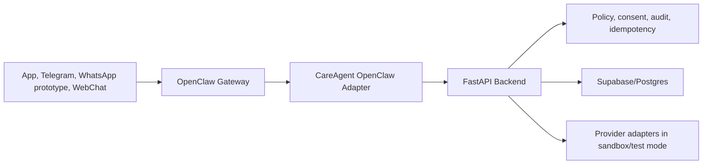

# OpenClaw Deployment Plan

Last updated: 2026-06-06

## Purpose

Deploy OpenClaw as a prototype channel/runtime gateway for CareAgent. This is a controlled integration layer, not the system of record and not the safety authority.

## Target Topology



## Deployment Phases

### Phase 0 - Local Proof

Run OpenClaw on a developer machine or isolated VM.

Commands from current OpenClaw docs:

```powershell
node --version
npm install -g openclaw@latest
openclaw onboard --install-daemon
openclaw gateway status
openclaw dashboard
```

Expected gateway:

- Local Control UI: `http://127.0.0.1:18789/`
- OpenClaw config: `~/.openclaw/openclaw.json`
- OpenClaw home/state can be moved with `OPENCLAW_HOME`, `OPENCLAW_STATE_DIR`, and `OPENCLAW_CONFIG_PATH`.

CareAgent backend environment for this phase:

```powershell
$env:AGENT_RUNTIME_ADAPTER = "mock"
$env:AGENT_RUNTIME_PROVIDER = "openclaw"
$env:AGENT_RUNTIME_MODEL = "openclaw/default"
$env:AGENT_RUNTIME_ENDPOINT_URL = "http://127.0.0.1:18789"
```

The adapter remains `mock` until the real OpenClaw adapter is implemented. This lets config and redaction tests run without network calls.

Exit criteria:

- OpenClaw dashboard starts locally.
- Backend config reports provider `openclaw` without leaking key values.
- Existing backend tests still pass.
- No real patient data is sent to OpenClaw.

### Phase 1 - Adapter Smoke Test

Implement a networked adapter behind the existing `AgentRuntimeAdapter` protocol.

Target backend files:

- `app/agent/runtime.py`
- `app/services/agent_runtime.py`
- `tests/test_agent_runtime_adapter.py`
- New tests for OpenClaw request mapping and failure handling.

Adapter behavior:

- Accept `AgentRuntimeRequest`.
- Convert messages and metadata into the OpenClaw-compatible request shape selected during implementation.
- Send only redacted, patient-scoped, policy-approved context.
- Enforce timeout from `AGENT_RUNTIME_TIMEOUT_SECONDS`.
- Return `AgentRuntimeResponse` with provider, model, text, tool calls, and redacted metadata.
- Fail closed on network errors, timeout, invalid response, or tool request that does not match `AGENT_TOOL_NAMES`.

Exit criteria:

- Unit tests pass with a fake OpenClaw HTTP server or mocked transport.
- Adapter cannot be enabled without explicit `AGENT_RUNTIME_ADAPTER=openclaw`.
- Production settings still reject unsafe combinations if added.

### Phase 2 - Private Staging Gateway

Run OpenClaw on a private VM/container reachable only from the backend private network or a tailnet.

Required hardening:

- Bind gateway to loopback or private network only.
- Require gateway auth token or trusted private proxy.
- Block public access to port `18789`.
- Run one OpenClaw gateway per trust boundary.
- Use a dedicated OS user/container and dedicated browser/profile/accounts.
- Disable broad runtime, filesystem, browser, exec, and elevated tools.
- Restrict channel DMs to pairing or allowlists.
- Keep WhatsApp Web style automation prototype-only.

OpenClaw security audit:

```powershell
openclaw security audit
openclaw security audit --deep
```

Exit criteria:

- Backend can reach OpenClaw over private network.
- Public internet cannot reach the gateway.
- Security audit findings are reviewed and tracked.
- Test-mode channel message can complete a harmless round trip.
- Audit logs show message receipt, tool policy decision, and reply.

### Phase 3 - Production-Hardening Decision

Before production traffic:

- Decide whether OpenClaw remains a prototype-only gateway or moves behind a stronger production wrapper.
- Evaluate NemoClaw or equivalent sandbox/network-policy deployment if OpenClaw will handle always-on healthcare traffic.
- Replace prototype WhatsApp Web automation with official WhatsApp Business Cloud API or an approved BSP for production healthcare workflows.
- Add provider webhooks, signature verification, replay protection, rate limits, receipts, retries, and dead-letter handling.
- Add human review and compliance signoff for all real calls/messages.

Exit criteria:

- Legal/compliance approves channel and call provider use.
- No OpenClaw route can execute real provider dispatch directly.
- All high-risk side effects require backend policy and idempotency.
- Prompt-injection, cross-patient isolation, stale-data, and replay tests pass.

## Production Environment Variables

Do not commit values.

| Variable | Purpose |
| --- | --- |
| `AGENT_RUNTIME_ADAPTER` | `mock` until network adapter exists; later `openclaw`. |
| `AGENT_RUNTIME_PROVIDER` | `openclaw`. |
| `AGENT_RUNTIME_MODEL` | Runtime/model label, for example `openclaw/default`. |
| `AGENT_RUNTIME_ENDPOINT_URL` | Private OpenClaw gateway URL. |
| `AGENT_RUNTIME_TIMEOUT_SECONDS` | Request timeout budget. |
| `AGENT_RUNTIME_API_KEY_ENV` | Name of env var containing gateway/provider token, if required. |
| `OPENCLAW_API_KEY` | Optional secret if the selected OpenClaw deployment requires it. |

## Rollback

1. Set `AGENT_RUNTIME_ADAPTER=mock`.
2. Disable OpenClaw channel ingress.
3. Keep backend policy, risk, escalation, and provider dispatch running independently.
4. Preserve audit logs and failed-request traces for review.
5. Re-run backend tests before re-enabling the adapter.

